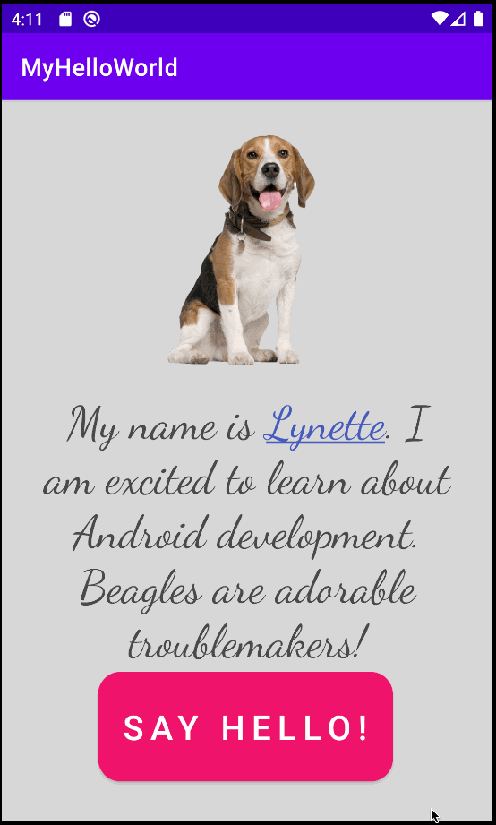

# HelloWorld
# Android Prework - HelloWorld

Submitted by: Lynette Reisdorf

HelloWorld is an android app that shows an image and introductory message, and allows pressing a button to display a Toast. It provides a hyperlink from the creator's name to their LinkedIn page.

Time spent: 4 hours spent in total

## Required Features

The following **required** functionality is completed:

* [x] Image and introductory message displayed on screen
* [x] Button displayed on screen
* [x] Toast with message appears when button is pressed 

The following **additional** features are implemented:

* [x] A hyperlink connects the creator's name to their LinkedIn page

## Video Walkthrough

Here's a walkthrough of implemented user stories:

GIF created with [LiceCap](http://www.cockos.com/licecap/).

## License

    Copyright 2022 Lynette Reisdorf

    Licensed under the Apache License, Version 2.0 (the "License");
    you may not use this file except in compliance with the License.
    You may obtain a copy of the License at

        http://www.apache.org/licenses/LICENSE-2.0

    Unless required by applicable law or agreed to in writing, software
    distributed under the License is distributed on an "AS IS" BASIS,
    WITHOUT WARRANTIES OR CONDITIONS OF ANY KIND, either express or implied.
    See the License for the specific language governing permissions and
    limitations under the License.
